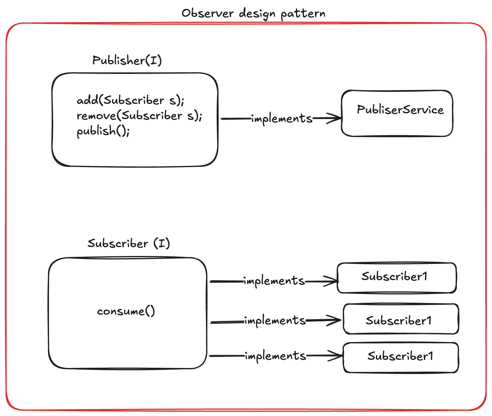

## 📘 Design Patterns

Always prefer UML diagrams for design patterns.

### UML Types
1. Class Diagram
2. Sequence Diagram
3. Object Diagram
4. State Diagram

---

## 🚀 Study Priority

### 🔥 Must Know
- Factory
- Strategy
- Singleton
- Adapter

---

### ⚡ Last Minute Revision
**Decorator Pattern**
- BasicCoffee → Coffee
- MilkDecorator → Coffee

**Observer Pattern**

---

### 🧠 If Time Permits
- Prototype & Registry
- Builder
- Flyweight

---

## 📊 Observer Design Pattern UML

  

