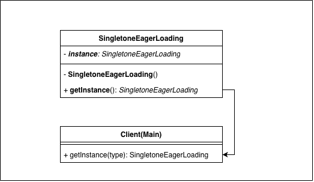

1. Eager loading : Basic version of singleton is EagerDB it will give you thread safety but will increase the app 
   start time and also create instance even if not needed on start of the JVM
   
2. SingleThread : It is **lazyloading** because instance will create on run time no memory wasted and app start time will be
                  fast but we have a problem of race condition
3. Double check : we will apply the lock on the function which is providing the instance and will solve the 
   race condition problem

While designing the Singleton we have to take remember common things for all the 3 version of singleton
1. make constructor private
2. declare a private static variable of type singletonClass
3. declare a public static method with return type singleton class
4. now right the logic in the getInstance method according to the type of singleton pattern you are designing

In multithreaded 
we have 3 ways : 
acquiring the locks on main function, resources will still take the lock 

    public static synchronized SyncDBConn createInstance() {
        if (dbConnection == null) {
        dbConnection = new SyncDBConn();
        }
        return dbConnection;
    }

This is the most accurate multithreaded singleton which we will used 

    if (dbConnection == null) {   // 1st check (without lock)
        synchronized (DoubleCheckDBConn.class) {
        if (dbConnection == null) {   // 2nd check (with lock)
            dbConnection = new DoubleCheckDBConn();
        }
    }

Now why not this :

    if (dbConnection == null) {
        synchronized (DoubleCheckDBConn.class) {
        dbConnection = new DoubleCheckDBConn();
        }
    }

•	Problem: Two threads could still both pass the if (dbConnection == null) check at the same time. 
•	Both enter the if block before either has created the instance. 
•	Each thread grabs the lock (one after another) and creates a new object → breaking singleton. 

That’s why you must check again inside the synchronized block.

